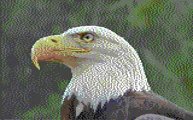

# C64 dithering

A program segítségével képeket lehet C64 KLA formátumú képekre konvertálni.

Input:


Output:



## Futtatás

```
python3 c64_dithering.py -i example/eagle.jpg -k example/eagle.kla -o example/eagle_conv.png -m <dithering_model> -p <palette>
```

A választható dithering modellek (-m opció):
- floyd_steinberg
- jarvis_judice_ninke
- stucki
- atkinson
- burkes
- sierra
- two_row_sierra
- sierra_lite

A modell opció megadása nem kötelező, az alapértelmezett érték: sierra

A választható paletták (-p opció):
- default 
  - (a "default" itt nem a konvertáló default palettáját jelenti, hanem paletta név)
- Pepto
- c64hq
- c64s
- ccs64
- frodo
- godot
- pc64
- colodore
- PALette

A paletta megadása nem kötelező, a alapértelmezett érték: Pepto


A program futtatásához az opencv-t fel kell telepíteni:

```
pip install opencv-python
```


## Konvertálás lépései

1. Az első lépés az input kép átméretezése 160x200-as képre. 
Az átméretezést a program CV2 segítségével végzi el, Lanczos interpolációt használ (ami a CV2 részeként elérhető). https://en.wikipedia.org/wiki/Lanczos_resampling


2. Például Floyd-Steinberg dithering algoritmus (https://en.wikipedia.org/wiki/Floyd%E2%80%93Steinberg_dithering) segítségével konvertáljuk át a képet a C64 színeit használó képre.

   A legközelebbi C64 színt a legkisebb távolság alapján választjuk ki:
   ```
   distance = sqrt(
           pow(red   - c64_red, 2) 
         + pow(green - c64_green, 2) 
         + pow(blue  - c64_blue, 2)
   )
   ```
   A program a kiválasztott színhez megnézni, hogy mennyi a hiba az eredeti pixelhez képest:
   ```
   error_red   = red - c64_red   
   error_green = green - c64_green 
   error_blue  = blue - c64_blue  
   ```
   Az eredeti pixelt lecseréli a C64-es színre.
   A környező pixeleket módosítja a hibával:
   ```
        |      | 3/16
   -----+------+------
        |  *   | 5/16
   -----+------+------
        | 7/16 | 1/16
   ```
   A * az eredeti pixelt jelenti. A program hozzáadja a hiba 3/16-od részét a tőle jobbra+fentebb elhelyezkedő pixelhez,
   5/16-od részét a jobbra elhelyezkedő pixelhez, az 1/16-od részét az alatta jobbra elhelyezkedő pixelhez, 
   és a 7/16-od részét az alatta elhelyezkedő pixelhel.

   A fenti eljárást mind a 160*200 pixelre elvégzi, fentről le, jobbról balra haladva. 
   Így az egyszer feldolgozott pixel RGB értéke biztos, hogy a C64 palettájából lesz kiválasztva 
   (már feldolgozott pixelt nem módosítunk a feldolgozás iránya miatt).
     
   A fenti algoritmus futtatása után kaptunk egy ditherelt képet, ami 16 színt tartalaz, de nem felel meg a
   C64 multicolor bitmap mód szín megkötéseinek, mert egy karakter területen több szín is előfordulhat, mint
   3 szín + a háttérszín.
      
      
3. A háttérszín kiválasztásakor megkeressük a teljes ditherelt 16 színű képen a leggyakoribb színt.


4. Karakter területenként készítünk egy szín táblázatot, ami az egy-egy karakter
   területen használható színeket tartalmazhatja csak. Ez a karakter területen belül a leggyakrabban használt 4 szín. 
   (amiből az egyiknek a háttérszínnek kell lennie, mert az az egész képre nézve egységes).


5. Utolsó lépésként újra lefut a ditherelés az eredeti képre, 
   de most már nem a teljes C64 palettát használja a program,
   hanem karakter területenként a kíválasztott színeket. Ha következő karakter területre ér,
   akkor az annak a területnek megfelelő (3. pontban kiválasztott) palettára vált át.
 

6. A program lementi a konvertált képet KLA és PNG formátumban.


## Kép

* Bald Eagle 
  - Photo by Bruce Hallman / USFWS
  - This file is licensed under the Creative Commons Attribution 2.0 Generic license.
  - Source: https://commons.m.wikimedia.org/wiki/File:Bald_Eagle_(16211336427).jpg

## Egyéb linkek:
   - Dithering algoritmusok: https://tannerhelland.com/2012/12/28/dithering-eleven-algorithms-source-code.html
   - Paletták: https://github.com/Hammarberg/pixcen/blob/master/C64Col.cpp
   - Távolság számítása két szín között: https://www.compuphase.com/cmetric.htm

